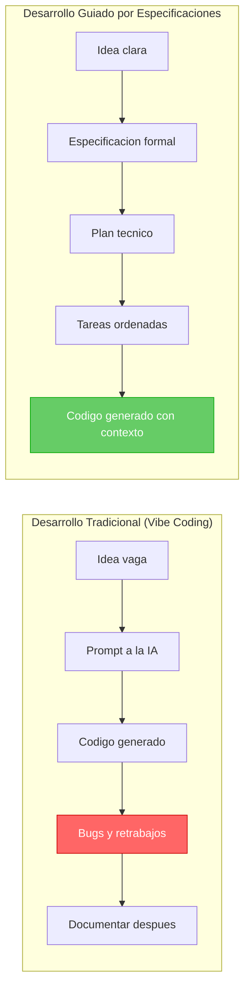
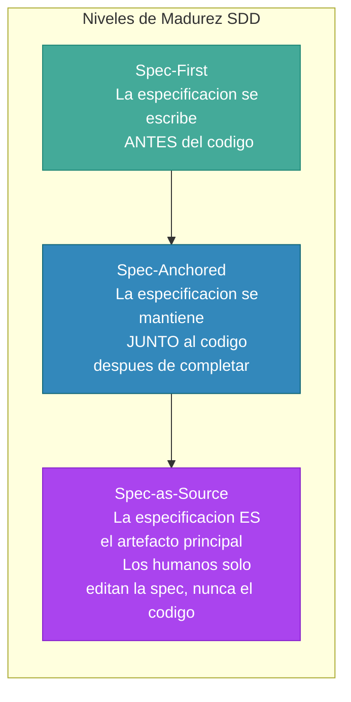
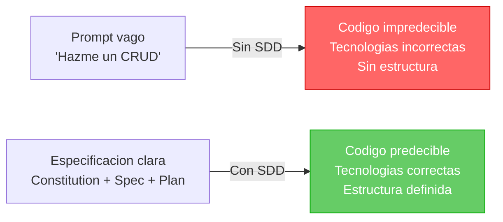
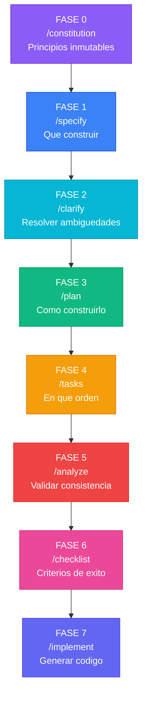
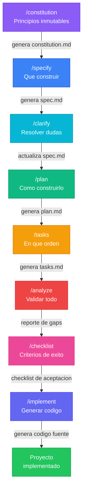
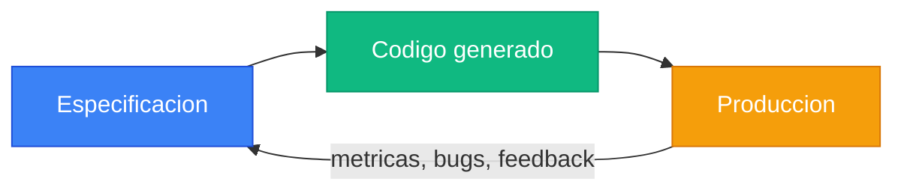
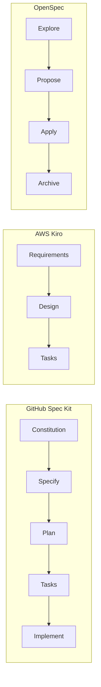

# Guia Completa: Desarrollo Guiado por Especificaciones (SDD) con GitHub Spec Kit

> **Autor:** Carlos Arturo Castro Castro
> **Fecha:** Abril 2026
> **Proposito:** Documento de referencia para entender SDD y dominar GitHub Spec Kit antes de aplicarlo en proyectos reales.

---

## Tabla de Contenidos

- [1. Que es SDD (Spec-Driven Development)](#1-que-es-sdd-spec-driven-development)
- [2. Que es GitHub Spec Kit](#2-que-es-github-spec-kit)
- [3. Instalacion](#3-instalacion)
- [4. Las 7 Fases y sus Comandos](#4-las-7-fases-y-sus-comandos)
- [5. Flujo Completo Visual](#5-flujo-completo-visual)
- [6. Archivos que Genera Spec Kit](#6-archivos-que-genera-spec-kit)
- [7. Mejores Practicas](#7-mejores-practicas)
- [8. Otras Herramientas SDD](#8-otras-herramientas-sdd)
- [9. Referencias](#9-referencias)

---

## 1. Que es SDD (Spec-Driven Development)

### Definicion

**Spec-Driven Development (SDD)** es un paradigma de desarrollo de software donde las **especificaciones son el artefacto principal**, no el codigo. En lugar de codificar primero y documentar despues, SDD invierte el flujo: primero se define **que** se debe construir con precision, y luego se genera el codigo a partir de esa definicion.

> *"Las especificaciones no sirven al codigo — el codigo sirve a las especificaciones."*
> — [GitHub Blog, 2025](https://github.blog/ai-and-ml/generative-ai/spec-driven-development-with-ai-get-started-with-a-new-open-source-toolkit/)

El Documento de Requisitos del Producto (PRD) deja de ser una guia para la implementacion y se convierte en **la fuente que genera la implementacion**.

### Desarrollo Tradicional vs SDD



### Por que funciona mejor con IA

Los modelos de lenguaje son excelentes completando patrones, pero **fallan con requisitos ambiguos**. Sin especificacion clara:

- La IA elige tecnologias que no pediste
- Genera codigo desconectado entre modulos
- No respeta convenciones del proyecto
- Produce soluciones que funcionan pero no se mantienen

SDD elimina la ambiguedad **antes** de generar codigo, dandole al agente de IA un contexto rico y preciso.

> *"Para producir la salida correcta, primero necesitas establecer un contexto realmente bueno."*
> — [Microsoft for Developers](https://developer.microsoft.com/blog/spec-driven-development-spec-kit)

### Tres Niveles de Madurez SDD



> *Clasificacion propuesta por Birgitta Bockeler en* [Martin Fowler's Blog](https://martinfowler.com/articles/exploring-gen-ai/sdd-3-tools.html):
> - **Spec-first:** la especificacion precede a la generacion de codigo.
> - **Spec-anchored:** las specs se mantienen junto al codigo despues de completar.
> - **Spec-as-source:** las specs son el artefacto primario; los humanos solo editan especificaciones.

---

## 2. Que es GitHub Spec Kit

### Definicion

**GitHub Spec Kit** es un toolkit open-source creado por GitHub que proporciona un proceso estructurado para llevar el Desarrollo Guiado por Especificaciones a los flujos de trabajo con agentes de IA.

Incluye:
- **CLI** para inicializar proyectos con la estructura SDD
- **Templates** predefinidos para especificaciones, planes y tareas
- **Prompts** optimizados que se usan como slash commands en tu asistente de IA
- **Metadata** y configuracion para cada plataforma

### Con que herramientas funciona

| Asistente de IA | Soporte |
|-----------------|---------|
| GitHub Copilot (VS Code) | Oficial |
| Claude Code (CLI) | Oficial |
| Gemini CLI | Oficial |
| Cursor | Compatible |

### Que problema resuelve



### Casos de uso ideales

| Caso | Descripcion |
|------|-------------|
| **Proyectos nuevos (Greenfield)** | Previene soluciones vagas generadas por IA al dar claridad desde el inicio |
| **Desarrollo de features** | Asegura que las nuevas funcionalidades se integren con el sistema existente |
| **Modernizacion de legacy** | Captura la logica de negocio original en especificaciones antes de reconstruir |

---

## 3. Instalacion

### Requisitos previos

- **Python 3.10+** instalado
- **uv** (gestor de paquetes Python rapido)

```bash
# Si no tienes uv instalado:
pip install uv
```

### Instalar e inicializar Spec Kit

```bash
# Instalar spec-kit e inicializar en el proyecto actual
uvx --from git+https://github.com/github/spec-kit.git specify init .
```

Durante la inicializacion, el wizard pregunta:
1. **Que asistente de IA usaras** (Copilot, Claude Code, Gemini CLI)
2. Crea la carpeta `.specify/` con templates y scripts
3. Configura los slash commands para tu asistente

### Estructura creada

```
mi-proyecto/
├── .specify/
│   ├── templates/        # Templates para spec, plan, tasks
│   ├── scripts/          # Scripts de plataforma (bash/PowerShell)
│   └── config.yaml       # Configuracion del toolkit
├── memory/
│   └── constitution.md   # Principios del proyecto (se crea con /constitution)
├── spec.md               # Especificacion (se crea con /specify)
├── plan.md               # Plan tecnico (se crea con /plan)
└── tasks.md              # Tareas (se crea con /tasks)
```

---

## 4. Las 7 Fases y sus Comandos

### Vision general



---

### FASE 0: `/constitution` — Principios Inmutables

| Aspecto | Detalle |
|---------|---------|
| **Que hace** | Establece las reglas no negociables del proyecto: tecnologias, patrones, practicas |
| **Archivo que genera** | `memory/constitution.md` |
| **Cuando se ejecuta** | Una sola vez al inicio del proyecto. Se puede editar despues |
| **Analogia** | Es como la Constitucion de un pais: define las leyes fundamentales que todos los demas comandos deben respetar |

**Que incluir en la constitution:**

- Lenguaje y framework obligatorio (ej: Python + Flask, no Django)
- Patron de arquitectura (ej: MVC, Clean Architecture)
- Libreria de testing (ej: pytest, no unittest)
- Formato de respuestas (ej: siempre JSON)
- Convenciones de nombres (ej: snake_case para Python)
- Restricciones de seguridad (ej: no hardcodear secretos)
- Integraciones obligatorias (ej: Swagger para documentacion)

**Ejemplo de prompt:**

```
/constitution

El proyecto es un frontend web con Flask y Jinja2.
- Debe usar Python 3.12 con Flask 3.x
- Templates con Jinja2 y Bootstrap 5
- Arquitectura: Blueprints por modulo
- Servicio generico centralizado para consumir API REST
- Middleware de autenticacion con JWT
- Control de acceso por rutas (RBAC)
- No usar ORM, el backend es una API REST externa
- Tests con pytest
- Variables de entorno en config.py, nunca hardcodeadas
```

**Lo que genera (ejemplo resumido):**

```markdown
# Constitution

## Article I - Technology Stack
- Python 3.12, Flask 3.x, Jinja2, Bootstrap 5

## Article II - Architecture
- Blueprint-based modular architecture
- Generic API service layer (no direct HTTP calls in routes)

## Article III - Security
- JWT-based authentication via middleware
- RBAC with route-level access control
- No hardcoded secrets

## Article IV - Testing
- pytest for all test scenarios
...
```

> **Importante:** Todos los comandos posteriores (`/specify`, `/plan`, `/tasks`) consultan la constitution para asegurar que sus salidas respeten estos principios.

---

### FASE 1: `/specify` — Especificar Funcionalidades

| Aspecto | Detalle |
|---------|---------|
| **Que hace** | Transforma tu descripcion de alto nivel en una especificacion formal con requisitos, flujos de usuario y criterios de aceptacion |
| **Archivo que genera** | `spec.md` |
| **Cuando se ejecuta** | Despues de la constitution. Se puede re-ejecutar para agregar features |
| **Analogia** | Es el "contrato" de lo que se va a construir. Lo que antes era un documento de requisitos (PRD) |

**Que incluir en el prompt:**

- Descripcion general del proyecto
- Listado de funcionalidades (CRUDs, autenticacion, reportes, etc.)
- Flujos de usuario principales
- Restricciones de negocio

**Ejemplo de prompt:**

```
/specify

El proyecto es un frontend Flask que consume una API REST generica en C#.
Funcionalidades:
- CRUD para: producto, persona, empresa, cliente, vendedor, rol, ruta
- Gestion de usuarios con roles (CRUD + asignacion de roles via SP)
- Gestion de facturas maestro-detalle via stored procedures
- Login con JWT, cambio de contrasena, recuperacion por email
- Control de acceso por rutas segun roles del usuario (RBAC)
- Menu de navegacion dinamico segun permisos
- Dashboard de inicio con resumen
```

**Lo que genera:** Un documento `spec.md` con secciones como:

- Descripcion del proyecto
- Requisitos funcionales (RF-001, RF-002, ...)
- Requisitos no funcionales
- Flujos de usuario (login, crear factura, etc.)
- Criterios de aceptacion por funcionalidad

---

### FASE 2: `/clarify` — Resolver Ambiguedades

| Aspecto | Detalle |
|---------|---------|
| **Que hace** | Identifica areas poco claras en la especificacion y genera hasta 5 preguntas para resolver ambiguedades. Las respuestas se incorporan al spec.md |
| **Archivo que modifica** | `spec.md` (actualiza con las respuestas) |
| **Cuando se ejecuta** | Despues de `/specify`. Es **opcional** pero muy recomendado |
| **Analogia** | Es como la reunion de aclaracion con el cliente antes de empezar a construir |

**Ejemplo de interaccion:**

```
/clarify
```

La IA podria preguntar:

1. *"La recuperacion de contrasena envia un email con contrasena temporal o con un link de reset?"*
2. *"El CRUD de usuario maneja la encriptacion BCrypt en el frontend o delega a la API?"*
3. *"El menu de navegacion se carga de la BD en cada request o se cachea en sesion?"*

Tu respondes cada pregunta y el agente actualiza `spec.md` con las decisiones.

---

### FASE 3: `/plan` — Plan Tecnico de Implementacion

| Aspecto | Detalle |
|---------|---------|
| **Que hace** | Convierte la especificacion en un plan tecnico detallado: arquitectura, componentes, dependencias, modelos de datos, contratos de API |
| **Archivo que genera** | `plan.md` |
| **Cuando se ejecuta** | Despues de `/specify` (y opcionalmente `/clarify`) |
| **Analogia** | Es el plano arquitectonico de la casa. Define COMO se construira lo que la spec pidio |

**Que incluye el plan generado:**

- Arquitectura de carpetas del proyecto
- Componentes y sus responsabilidades
- Dependencias y librerias a instalar
- Modelos de datos o contratos de API
- Flujos de autenticacion y autorizacion
- Estrategia de manejo de errores
- Verificacion contra la constitution

**Ejemplo de prompt:**

```
/plan
```

(No necesita prompt adicional — toma la spec.md y la constitution.md como entrada)

---

### FASE 4: `/tasks` — Tareas Ordenadas por Dependencia

| Aspecto | Detalle |
|---------|---------|
| **Que hace** | Descompone el plan en tareas concretas, aisladas y ordenadas por dependencia. Cada tarea es implementable y testeable de forma independiente |
| **Archivo que genera** | `tasks.md` |
| **Cuando se ejecuta** | Despues de `/plan` |
| **Analogia** | Es el tablero Kanban o la lista de issues de GitHub. Cada tarea es un ticket |

**Caracteristicas de las tareas generadas:**

- Numeradas y ordenadas por dependencia
- Marcadas como paralelizables cuando es posible
- Con criterios de completitud claros
- Cada una aborda un problema especifico

**Ejemplo de salida (fragmento):**

```markdown
## Tareas

- [ ] Task 1: Crear estructura del proyecto Flask con Blueprints
- [ ] Task 2: Implementar config.py con variables de entorno
- [ ] Task 3: Crear servicio generico ApiService (listar, crear, actualizar, eliminar)
- [ ] Task 4: Implementar layout base con Bootstrap 5 y Jinja2
- [ ] Task 5: Crear Blueprint de autenticacion (login, logout)
- [ ] Task 6: Implementar middleware de autenticacion JWT
- [ ] Task 7: Crear CRUD de producto (ruta + template)
  - Depende de: Task 3, Task 4
...
```

---

### FASE 5: `/analyze` — Validar Consistencia

| Aspecto | Detalle |
|---------|---------|
| **Que hace** | Revisa la consistencia entre `constitution.md`, `spec.md`, `plan.md` y `tasks.md`. Detecta contradicciones, gaps y ambiguedades entre artefactos |
| **Archivo que genera** | Reporte en pantalla (no genera archivo nuevo) |
| **Cuando se ejecuta** | Despues de `/tasks`. Es **opcional** pero recomendado antes de implementar |
| **Analogia** | Es la auditoria de calidad antes de empezar la construccion |

**Que detecta:**

- Requisitos en la spec que no tienen tareas asignadas
- Tareas que contradicen la constitution
- Dependencias faltantes en el plan
- Gaps entre lo especificado y lo planificado

**Ejemplo de prompt:**

```
/analyze
```

---

### FASE 6: `/checklist` — Criterios de Aceptacion

| Aspecto | Detalle |
|---------|---------|
| **Que hace** | Genera una checklist personalizada con criterios para verificar que cada requisito se cumplio. Es el equivalente a tests de aceptacion pero en formato humano |
| **Archivo que genera** | Checklist integrada en los artefactos existentes |
| **Cuando se ejecuta** | Despues de `/tasks`. Es **opcional** |
| **Analogia** | Es la lista de verificacion del inspector antes de entregar la obra |

**Ejemplo de prompt:**

```
/checklist
```

**Ejemplo de salida:**

```markdown
## Checklist de Aceptacion

### Autenticacion
- [ ] El login acepta email y contrasena
- [ ] El token JWT se almacena en sesion
- [ ] Las rutas protegidas redirigen a /login sin sesion
- [ ] El middleware valida permisos por ruta

### CRUD Producto
- [ ] Se puede listar productos con paginacion
- [ ] Se puede crear un producto con todos los campos
- [ ] Se puede editar un producto existente
- [ ] Se puede eliminar un producto con confirmacion
...
```

---

### FASE 7: `/implement` — Ejecutar las Tareas

| Aspecto | Detalle |
|---------|---------|
| **Que hace** | El agente de IA comienza a generar codigo tarea por tarea, siguiendo el orden definido en `tasks.md` y respetando la `constitution.md` |
| **Archivos que genera** | Los archivos del proyecto (codigo fuente) |
| **Cuando se ejecuta** | Despues de tener tasks (y opcionalmente analyze + checklist) |
| **Analogia** | Es la construccion. Los obreros (la IA) siguen los planos (spec + plan + tasks) |

**Comportamiento:**

1. Lee `tasks.md` y ejecuta cada tarea en orden
2. Verifica cada tarea contra la constitution
3. Se puede pausar entre fases para revisar y corregir
4. Genera commits o cambios incrementales

**Ejemplo de prompt:**

```
/implement
```

> **Consejo:** No ejecutes todas las tareas de golpe. Revisa el codigo despues de cada fase de tareas y corrige antes de continuar.

---

## 5. Flujo Completo Visual

### Flujo lineal con archivos generados



### Ciclo de retroalimentacion



> Las especificaciones son **documentos vivos**. Cuando aparecen bugs en produccion o cambian requisitos, se actualiza la spec y se regenera el codigo — no se parchea directamente.

---

## 6. Archivos que Genera Spec Kit

| Archivo | Fase que lo genera | Proposito |
|---------|-------------------|-----------|
| `memory/constitution.md` | `/constitution` | Principios inmutables del proyecto |
| `spec.md` | `/specify` | Requisitos funcionales, flujos de usuario, criterios de aceptacion |
| `plan.md` | `/plan` | Arquitectura, componentes, dependencias, modelos de datos |
| `tasks.md` | `/tasks` | Tareas numeradas, ordenadas por dependencia, con criterios de completitud |
| `.specify/templates/` | `specify init` | Templates reutilizables para cada artefacto |
| `.specify/config.yaml` | `specify init` | Configuracion del toolkit y plataforma |

### Estructura de carpetas completa

```
mi-proyecto/
├── .specify/
│   ├── templates/
│   │   ├── spec.md.tmpl          # Template para especificaciones
│   │   ├── plan.md.tmpl          # Template para plan tecnico
│   │   └── tasks.md.tmpl         # Template para tareas
│   ├── scripts/
│   │   ├── setup.sh              # Script de setup (Linux/Mac)
│   │   └── setup.ps1             # Script de setup (Windows)
│   └── config.yaml               # Configuracion del toolkit
├── memory/
│   └── constitution.md           # Principios del proyecto
├── spec.md                       # Especificacion generada
├── plan.md                       # Plan tecnico generado
├── tasks.md                      # Tareas generadas
└── (codigo fuente del proyecto)  # Generado por /implement
```

---

## 7. Mejores Practicas

### Recomendaciones oficiales

| Practica | Fuente | Detalle |
|----------|--------|---------|
| **Cargar detalle al inicio** | Microsoft | Prompts iniciales comprehensivos producen mejores specs con menos iteraciones |
| **Mantener la constitution** | GitHub Blog | Establecer principios no negociables desde el dia 1 |
| **Tratar specs como documentos vivos** | GitHub Blog | Actualizar especificaciones cuando cambian requisitos, como se hace con refactoring de codigo |
| **Usar diagramas Mermaid** | Practica comun | Incluir diagramas entidad-relacion, de flujo y de secuencia en la spec para que la IA entienda la estructura |
| **Revisar entre fases** | Microsoft | No ejecutar todo de golpe. Pausar despues de cada fase para validar |
| **Explorar multiples variantes** | GitHub Blog | Una misma spec puede generar implementaciones alternativas sin duplicar codigo |

### Criticas y limitaciones

| Critica | Fuente | Detalle |
|---------|--------|---------|
| **Overhead de revision** | [Martin Fowler / Bockeler](https://martinfowler.com/articles/exploring-gen-ai/sdd-3-tools.html) | Spec Kit genera archivos Markdown extensos y repetitivos. En algunos casos es mas facil revisar codigo que revisar tantos markdowns |
| **No escala a todos los problemas** | [Scott Logic](https://blog.scottlogic.com/2025/11/26/putting-spec-kit-through-its-paces-radical-idea-or-reinvented-waterfall.html) | Un bug fix simple no necesita 7 fases. El flujo completo es mejor para features medianas a grandes |
| **La IA no siempre sigue la spec** | Martin Fowler / Bockeler | A pesar del contexto amplio, los agentes a veces ignoran especificaciones o duplican codigo existente |
| **Paralelo con MDD** | Martin Fowler / Bockeler | El desarrollo dirigido por modelos (Model-Driven Development) tuvo problemas similares de rigidez. SDD podria repetir esos errores si se aplica dogmaticamente |

### Cuando usar SDD vs cuando NO

| Usar SDD | NO usar SDD |
|----------|-------------|
| Proyecto nuevo con multiples modulos | Bug fix de 5 lineas |
| Feature compleja (maestro-detalle, RBAC) | Cambio cosmestico (CSS, texto) |
| Equipo con multiples personas | Prototipo descartable |
| Proyecto con requisitos regulatorios | Script unico de automatizacion |
| Modernizacion de sistema legacy | Exploracion rapida de una idea |

---

## 8. Otras Herramientas SDD

| Herramienta | Creador | Flujo | Diferencia clave |
|-------------|---------|-------|------------------|
| **GitHub Spec Kit** | GitHub | Constitution → Specify → Plan → Tasks → Implement | Tiene `constitution` para principios inmutables. Muy personalizable |
| **AWS Kiro** | Amazon | Requirements → Design → Tasks | IDE completo (basado en Code OSS). Flujo mas simple de 3 pasos |
| **OpenSpec** | Comunidad | Explore → Propose → Apply → Archive | Orientado a **un cambio a la vez**. Ideal para brownfield/iterativo |
| **Tessl Framework** | Tessl | Spec-anchored y Spec-as-source | Enfocado en que la spec sea la unica fuente de verdad |



---

## 9. Referencias

### Fuentes oficiales

- [GitHub Blog - Spec-driven development with AI](https://github.blog/ai-and-ml/generative-ai/spec-driven-development-with-ai-get-started-with-a-new-open-source-toolkit/) — Anuncio oficial del toolkit por GitHub
- [GitHub Spec Kit - Repositorio](https://github.com/github/spec-kit) — Codigo fuente y templates del toolkit
- [Spec Kit - Documentacion oficial](https://github.github.com/spec-kit/) — Documentacion completa del proyecto
- [GitHub Spec Kit - spec-driven.md](https://github.com/github/spec-kit/blob/main/spec-driven.md) — Definicion formal de SDD por GitHub

### Analisis de fuentes reconocidas

- [Microsoft for Developers - Diving Into Spec-Driven Development](https://developer.microsoft.com/blog/spec-driven-development-spec-kit) — Perspectiva de Microsoft sobre SDD y Spec Kit
- [Martin Fowler / Birgitta Bockeler - Understanding SDD Tools](https://martinfowler.com/articles/exploring-gen-ai/sdd-3-tools.html) — Analisis critico comparando Kiro, Spec Kit y Tessl
- [Scott Logic - Putting Spec Kit Through Its Paces](https://blog.scottlogic.com/2025/11/26/putting-spec-kit-through-its-paces-radical-idea-or-reinvented-waterfall.html) — Evaluacion practica con criticas constructivas

### Tutoriales y guias

- [LogRocket Blog - Exploring spec-driven development with GitHub Spec Kit](https://blog.logrocket.com/github-spec-kit/) — Tutorial con los 7 comandos detallados
- [Level Up Coding - Practical Guide with SpecKit and Copilot](https://levelup.gitconnected.com/exploring-spec-driven-development-sdd-a-practical-guide-with-github-speckit-and-copilot-72fd9a70535a) — Guia practica paso a paso (Marzo 2026)
- [Visual Studio Magazine - GitHub Open Sources Kit for Spec-Driven AI Development](https://visualstudiomagazine.com/articles/2025/09/03/github-open-sources-kit-for-spec-driven-ai-development.aspx) — Cobertura de prensa tecnica

### Video de referencia

- [YouTube - GitHub Spec Kit Tutorial](https://www.youtube.com/watch?v=QzSCmSFKvko) — Video tutorial que inspiro este documento
