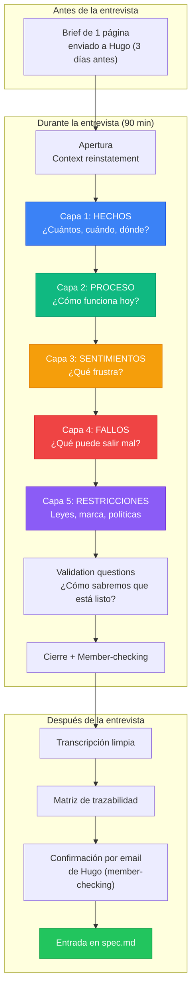
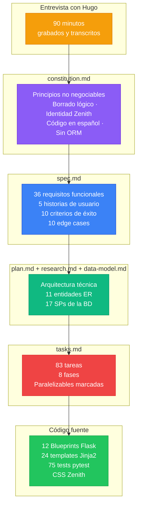

# Entrevista de Levantamiento de Requisitos

## Cliente: Zenith Comercial S.A.S.

> **Analista:** Carlos Arturo Castro Castro
> **Entrevistado:** Hugo Paco de Lucía (Gerente Comercial)
> **Fecha:** 15 de marzo de 2026
> **Duración:** 90 minutos
> **Modalidad:** Presencial, oficina principal de Zenith (Medellín)
> **Grabación:** Autorizada por el entrevistado
> **Documento:** Versión 1.0 — Aprobado por Hugo el 17/03/2026

---

## Tabla de Contenidos

- [1. Propósito y Alcance](#1-propósito-y-alcance)
- [2. Metodología Aplicada](#2-metodología-aplicada)
- [3. Perfil del Entrevistado](#3-perfil-del-entrevistado)
- [4. Brief Previo Enviado a Hugo](#4-brief-previo-enviado-a-hugo)
- [5. Apertura — Context Reinstatement](#5-apertura--context-reinstatement)
- [6. Bloque A — Hechos (Factual Layer)](#6-bloque-a--hechos-factual-layer)
- [7. Bloque B — Proceso (Workflow Layer)](#7-bloque-b--proceso-workflow-layer)
- [8. Bloque C — Sentimientos (Motivations Layer)](#8-bloque-c--sentimientos-motivations-layer)
- [9. Bloque D — Fallos (Failures Layer)](#9-bloque-d--fallos-failures-layer)
- [10. Bloque E — Restricciones (Constraints Layer)](#10-bloque-e--restricciones-constraints-layer)
- [11. Validation Questions y Member-Checking](#11-validation-questions-y-member-checking)
- [12. Cierre y Próximos Pasos](#12-cierre-y-próximos-pasos)
- [13. Matriz de Trazabilidad](#13-matriz-de-trazabilidad)
- [14. Artefactos Derivados](#14-artefactos-derivados)
- [15. Lecciones Aprendidas](#15-lecciones-aprendidas)
- [16. Referencias](#16-referencias)

---

## 1. Propósito y Alcance

### Objetivo

Levantar los requisitos funcionales, no funcionales y restricciones del sistema de ventas y facturación que Zenith Comercial S.A.S. necesita construir para reemplazar su gestión actual basada en hojas de cálculo.

### Alcance de esta entrevista

- Contexto del negocio
- Flujos de venta y facturación actuales
- Roles de usuarios y permisos esperados
- Reglas regulatorias (contables y tributarias)
- Identidad visual corporativa
- Expectativas de rendimiento

### Fuera de alcance

- Integración con pasarelas de pago (futuro)
- Reportes analíticos avanzados (futuro)
- App móvil (futuro)
- Migración masiva de datos históricos (se evaluará después)

---

## 2. Metodología Aplicada

Esta entrevista sigue las prácticas del **Business Analysis Body of Knowledge (BABOK v3)** publicado por el [IIBA](https://www.iiba.org/) y el estándar **ISO/IEC/IEEE 29148:2018** para ingeniería de requisitos.

### Técnicas utilizadas

| Técnica | Fuente | Cómo se aplicó |
|---------|--------|----------------|
| **Interview Technique** | BABOK §10.25 | Entrevista estructurada con preguntas abiertas, cara a cara |
| **Brief previo de una página** | aqua-cloud | Documento enviado a Hugo 3 días antes con propósito, temas, duración y consentimiento |
| **Context Reinstatement** | aqua-cloud | Apertura con "cuénteme cómo fue un día típico la semana pasada" |
| **Progressive Probing** | aqua-cloud | 5 capas: hechos → proceso → sentimientos → fallos → restricciones |
| **Open-ended questions** | BABOK §10.25 | Preguntas que no se responden con "sí/no" para elicitar narrativas |
| **Five W's + H** | Framework clásico | Who, What, Where, When, Why, How |
| **Follow-up probing** | BABOK §10.25 | "Cuénteme más", "¿a qué se refiere exactamente?" |
| **Member-checking** | aqua-cloud | Al final, resumen leído a Hugo para confirmación |
| **Traceability matrix** | IEEE 29148 | Tabla final que mapea cita → requisito → artefacto |

### Por qué estas técnicas

> *"Los equipos fallan cuando se quedan en respuestas superficiales. Usar progressive probing — capas de preguntas que van de hechos a sentimientos a fallos a restricciones — evita aceptar la primera respuesta como final."*
> — [aqua-cloud: 8 Essential Strategies for Effective Requirements Elicitation](https://aqua-cloud.io/8-essential-strategies-effective-requirements-elicitation/)

### Estructura de la entrevista



---

## 3. Perfil del Entrevistado

### Datos personales y profesionales

| Campo | Valor |
|-------|-------|
| **Nombre** | Hugo Paco de Lucía |
| **Edad** | 52 años |
| **Cargo** | Gerente Comercial |
| **Empresa** | Zenith Comercial S.A.S. |
| **Sede** | Medellín (oficina principal) |
| **Antigüedad en Zenith** | 8 años |
| **Experiencia total en sector** | 20 años (antes: DistriTech S.A. y CompuNorte Ltda.) |
| **Formación** | Administración de Empresas — Universidad Nacional (2004) |
| **Idiomas** | Español (nativo), Inglés (nivel intermedio) |

### Competencias del entrevistado

| Área | Nivel | Observación |
|------|-------|-------------|
| Ventas B2B | Experto | Lidera equipo de 8 vendedores |
| Gestión de inventario | Experto | Maneja catálogo de 200+ productos |
| Facturación y tributaria | Alto | Conoce DIAN, resoluciones, conservación de documentos |
| Manejo de personal | Alto | Gerente de 20 empleados entre sedes |
| Tecnología (usuario) | Intermedio | Usa Excel avanzado, correo, WhatsApp Business |
| Programación | Nulo | No conoce código, BD, APIs |

### Por qué Hugo es la persona correcta

- Conoce **el negocio** en profundidad (20 años en sector tecnológico)
- Está **afectado directamente** por el problema (lidera las ventas, reporta a gerencia)
- Tiene **autoridad** para aprobar decisiones funcionales
- Conoce **las 3 sedes** (viaja mensualmente a Bogotá y Cali)
- **No es técnico**, por lo que las respuestas están en lenguaje de negocio — ideal para un spec libre de detalles de implementación

### Estilo de comunicación observado

- **Directo y práctico**: responde con ejemplos concretos, no teoría
- **Narrativo**: le gusta contar historias de clientes reales ("acuérdate del caso de…")
- **A veces se desvía**: hay que reconducir con preguntas específicas
- **Visual**: pide papel y lápiz para dibujar procesos
- **Protector de su equipo**: habla "nosotros" en lugar de "yo"

---

## 4. Brief Previo Enviado a Hugo

Tres días antes de la entrevista se envió este brief a Hugo por email, siguiendo la práctica recomendada por [aqua-cloud](https://aqua-cloud.io/8-essential-strategies-effective-requirements-elicitation/) de "un brief de una página con propósito, temas, duración y consentimiento de grabación".

> **De:** carlos.castro@zenith.com.co
> **Para:** hugo.pacodelucia@zenith.com.co
> **Fecha:** 12 de marzo de 2026
> **Asunto:** Entrevista del viernes — levantamiento del sistema nuevo
>
> Hola Hugo,
>
> Confirmo nuestra reunión del **viernes 15 de marzo, 9:00 AM a 10:30 AM**, en tu oficina.
>
> **Propósito:** Levantar los requisitos del nuevo sistema de ventas que reemplazará las hojas de cálculo. Tu input es la base de todo lo que viene después.
>
> **Temas que cubriremos:**
>
> 1. Contexto de Zenith (10 min)
> 2. Cómo se hacen las ventas hoy (20 min)
> 3. Roles y permisos que necesitamos (15 min)
> 4. Lo que te frustra del sistema actual (10 min)
> 5. Qué pasa cuando hay errores (15 min)
> 6. Reglas legales y tributarias (10 min)
> 7. Identidad visual de Zenith (5 min)
> 8. Cierre y próximos pasos (5 min)
>
> **Qué necesito de ti:**
> - Traer un ejemplo de factura reciente (puede ser impresa o PDF)
> - Acceso a 2-3 facturas que hayan sido anuladas o con errores
> - Tu confirmación para grabar la reunión (solo audio, para transcribir — no se comparte)
>
> **Qué entregaré después:**
> - Transcripción limpia en 2 días
> - Documento formal de requisitos (spec) en 3 días para tu revisión
> - Un prototipo visual en 2 semanas
>
> Cualquier duda me avisas.
>
> Saludos,
> Carlos

**Respuesta de Hugo (12/03/2026, 15:30):**

> *"Confirmado Carlos. Autorizo grabación. Traeré 5 facturas: 3 normales y 2 que tuvimos que anular. Nos vemos el viernes."*

---

## 5. Apertura — Context Reinstatement

> **Técnica:** [Context Reinstatement](https://aqua-cloud.io/8-essential-strategies-effective-requirements-elicitation/) — Poner al entrevistado en modo narrativo pidiéndole que recuerde una situación real reciente, en vez de hipótesis abstractas.

**CARLOS:** Hugo, antes de entrar en preguntas específicas, cuéntame cómo fue el miércoles pasado. Un día cualquiera de ventas. No me digas cómo debería ser el nuevo sistema, cuéntame qué pasó ese miércoles.

**HUGO:** *(se recuesta en la silla, piensa unos segundos)* Haber… el miércoles empezamos temprano, como a las 7:30 estaba Andrea — es una de las cajeras — abriendo la sede de acá de Medellín. Lo primero que hace siempre es revisar el correo a ver si cayeron pedidos de la noche. Ese miércoles habían caído como 12 pedidos nuevos entre Bogotá y Cali.

Entonces Andrea los va pasando uno por uno a mi vendedor, que es Carlos Ramírez, para que llame al cliente, confirme el pedido y le diga cuánto demora. Mientras tanto, ella mira en el archivo de Excel del inventario qué hay disponible. Porque nuestro sistema de hoy es un Excel compartido en Google Drive. Eso es lo que llamamos "el sistema"… *(se ríe)*

Bueno. Como a las 10:00 llega el caso del día. Un cliente nuevo, una empresa de acá de Envigado, pidió 15 laptops y 20 mouse. Carlos hizo la cotización en otro Excel, le llamó al cliente, le dijo el precio, el cliente aceptó. Entonces Carlos me pasó el pedido a mí para que yo aprobara el crédito — porque era cliente nuevo, ¿ves? — y yo tuve que llamar al contador para que revisara si la empresa tenía buen cupo en DataCrédito.

Una hora después, aprobamos. Ahí Andrea imprime la factura desde otro Excel, le pone el consecutivo, la firma Carlos, la firmo yo, y se va al cliente. Y Andrea anota manual en el Excel de inventario que hay 15 laptops menos y 20 mouse menos.

Y ahí fue cuando nos dimos cuenta. Andrea se había confundido: en el Excel del inventario teníamos 12 laptops, no 15. Pero Carlos ya había facturado 15 porque miró en un Excel viejo que no estaba actualizado. *(pausa, mueve la cabeza)* Ya facturamos a un cliente nuevo con 3 laptops que no teníamos. Tocó llamarle, pedirle disculpas, refacturar por 12 y prometerle las otras 3 para la semana siguiente.

Eso es un día cualquiera.

> 💡 **Nota del analista:** En 3 minutos Hugo ya me dio 6 requisitos sin saberlo: (1) necesitan multi-usuario concurrente, (2) el stock debe descontarse automáticamente al facturar, (3) debe haber un rol cajero y un rol vendedor separados, (4) los errores de stock cuestan dinero y confianza, (5) las facturas tienen consecutivo (regulatorio), (6) los clientes nuevos requieren aprobación adicional. Esta anécdota se traducirá después en **FR-025 (crear factura)**, **FR-027 (descontar stock)**, **FR-028 (rechazar si stock insuficiente)**, **SC-009 (no inconsistencias)**.

---

## 6. Bloque A — Hechos (Factual Layer)

> **Propósito:** Obtener datos cuantificables y objetivos para dimensionar el sistema.

### A.1 — Estructura de la empresa

**CARLOS:** ¿Cuántas sedes tiene Zenith y dónde están?

**HUGO:** Tres sedes: Medellín, que es la principal — donde estamos ahora. Bogotá en Chapinero. Y Cali en el barrio Granada. En total somos 20 empleados.

**CARLOS:** ¿Se manejan todas las sedes igual o cada una tiene su manera?

**HUGO:** Igual pero no. Todas facturan con la misma razón social, Zenith Comercial S.A.S., pero cada sede tiene sus vendedores y sus clientes propios. Lo que sí compartimos es el inventario — los productos son los mismos en las tres.

> 💡 **Nota del analista:** → **Multi-sede con inventario compartido**. No requiere módulo especial de sucursales en MVP (se maneja con filtros por vendedor/cliente). Evitar sobre-diseño.

### A.2 — Volumen de operaciones

**CARLOS:** ¿Cuántas facturas emiten al día entre las tres sedes?

**HUGO:** Un día normal: entre 15 y 25 facturas. Fin de mes sube a 40-50 porque los clientes empresariales cierran pedidos.

**CARLOS:** ¿Y productos en el catálogo?

**HUGO:** Ahorita tenemos unos 200 productos activos. Pero en alta rotación son como 50.

**CARLOS:** ¿Cuántos clientes registrados?

**HUGO:** Unos 400 clientes activos. Empresas la mayoría, como un 20% personas naturales.

> 💡 **Nota del analista:** → **Escala: ~50 facturas/día pico, 200 productos, 400 clientes**. Volumen pequeño-mediano. Performance objetivo: listado de cualquier catálogo con ≤500 registros en ≤2s es suficiente. Esto se convertirá en **SC-002 (login ≤5s)** y **SC-004 (factura ≤3s)**.

### A.3 — Stack actual

**CARLOS:** ¿Qué usan hoy para gestionar todo esto?

**HUGO:** Excel. *(se ríe)* Todo en Excel compartido en Google Drive. Tenemos un Excel de productos, un Excel de clientes, un Excel de facturas, un Excel de inventario, un Excel de comisiones de vendedores… Y cada sede tiene copia de algunos.

**CARLOS:** ¿Hay algún sistema de facturación electrónica?

**HUGO:** La DIAN exige factura electrónica desde hace años. Usamos un proveedor externo que se llama Siigo, pero solo para el tema tributario — la factura electrónica oficial. Todo el resto de gestión es Excel.

> 💡 **Nota del analista:** → Siigo es una **integración futura** fuera del alcance del MVP. El nuevo sistema producirá la factura "operativa" con consecutivo interno; la electrónica DIAN se delega a Siigo vía API en una fase 2.

---

## 7. Bloque B — Proceso (Workflow Layer)

> **Propósito:** Entender el flujo de trabajo actual paso a paso para modelar los procesos del sistema nuevo.

### B.1 — Quiénes usan el sistema

**CARLOS:** Cuéntame los roles de las personas que usarían este nuevo sistema.

**HUGO:** *(toma papel y lápiz, empieza a dibujar)* A ver. Tenemos:

1. **Yo y las dos gerentes de sede**, que somos los que aprobamos cosas importantes. Nos llamaría "administradores".
2. **Los vendedores** — 8 en total entre las tres sedes. Ellos son los que registran clientes, cotizan y facturan.
3. **Las cajeras** — 3, una por sede. Son las que manejan el inventario y procesan los pedidos del día.
4. **El contador** — externo, pero consulta el sistema para conciliar con Siigo y los reportes tributarios.
5. **Los clientes** — algunos piden acceso para ver su historial de compras.

**CARLOS:** ¿Todos ven lo mismo o hay cosas que solo unos pueden hacer?

**HUGO:** ¡No, para nada! Un vendedor no puede andar viendo todo. Por ejemplo, el vendedor no puede crear usuarios nuevos, ni borrar facturas. El contador solo necesita ver reportes, no factura. La cajera ve facturas de su sede pero no de las otras. Y un cliente solo ve lo suyo.

> 💡 **Nota del analista:** → **5 roles claros: Administrador, Vendedor, Cajero, Contador, Cliente**. Requiere **RBAC (Role-Based Access Control)**. Esto se convertirá en **FR-006 a FR-010** y las 5 filas de la tabla `rol` en la BD.

### B.2 — Flujo de venta paso a paso

**CARLOS:** Ya me contaste el miércoles pasado. Ahora dibújame en papel los pasos exactos que sigue una venta, del principio al fin.

**HUGO:** *(dibuja)*

```
1. Cliente llama o escribe → [Vendedor atiende]
2. Vendedor abre Excel de productos y cotiza
3. Cliente acepta → Vendedor pasa pedido a Cajera
4. Cajera revisa stock en Excel inventario
5. Si cliente es nuevo o monto > $5M → Administrador aprueba crédito
6. Cajera genera factura (consecutivo + fecha + cliente + líneas + total)
7. Cajera descuenta stock en Excel inventario
8. Cajera sube factura a Siigo (electrónica DIAN)
9. Factura se entrega al cliente
10. Contador revisa al cierre del día
```

**CARLOS:** ¿Y si la factura tiene varios productos?

**HUGO:** Obvio. La mayoría de facturas tienen varias líneas. Una empresa te pide 10 laptops y 20 mouse y 5 teclados, todo en una factura. Cada línea tiene su cantidad, precio unitario y subtotal. Al final la factura suma todo.

**CARLOS:** ¿Cómo se maneja eso en Excel?

**HUGO:** Mal. Son dos hojas: una con los datos generales de la factura (número, cliente, fecha, total) y otra con las líneas. Las unimos manualmente cada mañana para el reporte. *(suspira)*

> 💡 **Nota del analista:** → **Patrón maestro-detalle para facturas**. Una factura (maestro) con N líneas de producto (detalle). Esto NO se puede resolver con un CRUD simple: requiere **stored procedures con transacciones** para garantizar atomicidad (si falla una línea, se revierte toda la factura). → **FR-025 a FR-030** y el SP `sp_insertar_factura_y_productosporfactura`.

### B.3 — ¿Qué información va en una factura?

**CARLOS:** Me pasas una de las facturas que trajiste para revisarla juntos.

**HUGO:** *(saca factura impresa)* A ver, aquí tienes una. Lo que va es:

- **Número consecutivo** (acá dice #1247)
- **Fecha** de emisión
- **Datos del cliente**: razón social, NIT, dirección, teléfono
- **Datos del vendedor**: nombre, código de vendedor, carnet interno
- **Líneas de productos**: código, descripción, cantidad, precio unitario, subtotal
- **Total general**
- **Estado**: acá normalmente no dice nada, pero cuando se anula se le pone un sello rojo que dice "ANULADA"

**CARLOS:** Esa información del cliente y del vendedor… ¿está en otra tabla o la escriben a mano?

**HUGO:** Se copia del Excel de clientes y del Excel de vendedores. Lo que pasa es que a veces la cajera se confunde y copia un cliente por otro. O pone el nombre del cliente pero no el NIT.

> 💡 **Nota del analista:** → Las facturas tienen **relaciones con cliente, vendedor y productos**. El sistema debe usar **FKs (Foreign Keys)** y presentar los datos enriquecidos automáticamente (nombre del cliente en vez de solo un ID). → **FR-019 (listados enriquecidos)** y la estructura de FKs en `factura.fkidcliente`, `factura.fkidvendedor`, `productosporfactura.fkcodproducto`.

---

## 8. Bloque C — Sentimientos (Motivations Layer)

> **Propósito:** Descubrir frustraciones y motivaciones que revelan requisitos no explícitos.

### C.1 — Frustraciones con el sistema actual

**CARLOS:** ¿Qué es lo que más te frustra del sistema actual?

**HUGO:** *(resopla)* Voy a ser franco. Lo peor son los errores humanos. Como el del miércoles. Cuando tienes todo en Excel, dos personas editando al tiempo, versiones viejas dando vueltas… te vas a equivocar sí o sí. Y cada error cuesta plata y confianza del cliente.

Lo segundo: que **nadie sabe quién hizo qué**. Si encuentro una factura mal hecha, no sé si fue Carlos o Laura la que la hizo. No hay trazabilidad. Eso me saca canas.

Lo tercero: **reportes**. Yo para saber cuánto vendió cada vendedor este mes, tengo que sentarme un sábado a armar una tabla dinámica. Debería tener un reporte en un clic.

**CARLOS:** ¿Y lo que más te frustra NO del sistema sino del día a día?

**HUGO:** Que las cosas dependen demasiado de mí. Si yo me voy a vacaciones, el negocio se frena porque nadie más puede aprobar créditos ni configurar nada. El sistema nuevo debería permitir que yo delegue eso a las gerentes de sede sin que pueda hacer de todo.

> 💡 **Nota del analista:** → Requisitos implícitos:
> 1. **Auditoría**: saber qué usuario hizo cada cambio (user tracking en cada operación). No está en MVP pero vale una nota para la fase 2.
> 2. **Delegación por rol**: el administrador puede crear otros administradores o delegar tareas específicas sin dar todo el poder. → Esto se cubre con **FR-021 a FR-024 (administración de usuarios y roles)**.
> 3. **Reportes**: fuera del MVP pero hay que registrarlo como fase 2.

### C.2 — ¿Cómo sería un sistema perfecto?

**CARLOS:** Si pudieras pedir el sistema ideal, sin límite de presupuesto, ¿cómo sería?

**HUGO:** *(piensa)* Sencillo. Que la cajera abra, vea el pedido, seleccione el cliente, agregue productos como quien arma un pedido en MercadoLibre, y dé clic en "Facturar". Todo: descontar stock, calcular el total, generar el PDF, subirlo a Siigo. Todo de una.

Y que yo pueda entrar desde mi casa y ver: "hoy vendimos tanto", "faltan estos productos", "este vendedor va adelantado este mes". Sin tener que pedirle a nadie que me pase un Excel.

Y que los errores se detecten **antes** de que pasen. Que si yo intento facturar 15 laptops y solo hay 12, el sistema me diga "ojo, solo hay 12" antes de darle "guardar".

> 💡 **Nota del analista:** → Confirma tres cosas ya identificadas: (1) flujo maestro-detalle fluido, (2) validación preventiva en el frontend, (3) dashboard (fuera de MVP). → La validación preventiva se convierte en **FR-028 (rechazar stock insuficiente)**.

---

## 9. Bloque D — Fallos (Failures Layer)

> **Propósito:** Descubrir casos borde y errores reales que el sistema debe manejar. [aqua-cloud](https://aqua-cloud.io/8-essential-strategies-effective-requirements-elicitation/) recomienda "probar edge cases, error handling y testability" — cosas que los stakeholders rara vez mencionan sin que se les pregunte.

### D.1 — ¿Qué pasa cuando una factura tiene errores?

**CARLOS:** Ya me mostraste las facturas anuladas que trajiste. Cuéntame el caso de la factura #892.

**HUGO:** *(abre la factura con sello rojo "ANULADA")* Esta la hicimos en enero. Fue un pedido de 30 monitores para una empresa de Cali. La cajera se equivocó y puso el NIT de otra empresa similar — la del cliente "Multimedia Andina" en lugar de "Multimedia Andes". Una letra. Pero la DIAN ya tenía registrada la factura electrónica con el NIT equivocado.

**CARLOS:** ¿Qué hicieron?

**HUGO:** **No se puede borrar**. Por ley no se pueden borrar facturas. La DIAN exige conservar todo por **7 años**, aunque esté mal. Lo que se hace es **anular** la factura: queda registrada pero marcada como "anulada", y se emite una nueva con los datos correctos. El stock que se había descontado de los 30 monitores se tuvo que volver a sumar.

**CARLOS:** Entonces el sistema NUNCA debe permitir borrar facturas…

**HUGO:** *(interrumpe)* Espera. Sí, para cualquier empleado, nunca. Pero **yo como gerente** sí puedo borrar físicamente si se trata de una factura de prueba del sistema, por ejemplo. O si se creó por un error técnico antes de ser oficial. Eso es mi responsabilidad.

**CARLOS:** O sea, borrado normal = nunca; borrado de administrador = solo en casos excepcionales y bajo su responsabilidad.

**HUGO:** Exacto.

> 💡 **Nota del analista:** → Principio **inmutable** (va a constitution): **las facturas usan borrado lógico por defecto (anulación)** y el **borrado físico solo lo hace el administrador**. → **FR-031 (anular)**, **FR-032 (permanecer visibles)**, **FR-034 (delete solo admin)**. Esto genera el **SP `sp_anular_factura`** (borrado lógico) y **`sp_borrar_factura_y_productosporfactura`** (borrado físico restringido).

### D.2 — ¿Y si se daña el stock?

**CARLOS:** Cuando se anula una factura, ¿qué pasa con el stock?

**HUGO:** Se tiene que restaurar. Si la factura decía "30 monitores", esos 30 monitores que se habían descontado del inventario tienen que volver a sumarse. Automáticamente. Si no, perdemos la cuenta.

> 💡 **Nota del analista:** → El SP de anulación debe **restaurar el stock** como parte de la transacción. Si solo cambia el estado sin restaurar stock, el inventario queda inconsistente. Esto ya está cubierto en el SP `sp_anular_factura` del diseño técnico.

### D.3 — ¿Qué pasa si se cae el sistema a mitad de factura?

**CARLOS:** Imaginemos que una cajera está facturando y a la mitad se va la luz. ¿Qué debería pasar?

**HUGO:** Lo ideal es que la factura no quede a medio hacer. O se guarda completa, o no se guarda nada. Porque si queda a medias — con 2 de 5 productos descontados del stock pero sin total calculado — eso es un desastre.

> 💡 **Nota del analista:** → **Transacciones atómicas**. Si falla cualquier parte de la creación de factura, se revierte todo. Esto se llama "todo o nada" en BD. Ya está cubierto en los stored procedures (`BEGIN TRANSACTION / COMMIT / ROLLBACK`). → Se convierte en **Edge Case en la spec**: "Factura con cero productos → el formulario no permite guardar".

### D.4 — ¿Qué pasa con las contraseñas?

**CARLOS:** La gente se olvida las contraseñas todo el tiempo. ¿Cómo lo manejan?

**HUGO:** Ahorita no hay contraseñas, porque el "sistema" es un Excel compartido. Pero en el sistema nuevo, sé que van a necesitar. Mi idea es que si alguien la olvida, se la envíe al correo una contraseña temporal, y que el sistema la obligue a cambiarla la primera vez que entre.

**CARLOS:** ¿Y si alguien intenta adivinar el correo de otro para que le llegue la contraseña temporal?

**HUGO:** *(piensa)* Buena pregunta. Que el sistema no diga si el correo existe o no. Que simplemente diga "si el correo está registrado, llegará un mensaje". Así no se puede usar para espiar.

> 💡 **Nota del analista:** → Hugo acaba de especificar **FR-015 (mensaje neutro en recuperación)** sin saber que es una práctica estándar de seguridad. Esto es oro — cuando el stakeholder razona correctamente sin conocimiento técnico, es señal de que entiende el problema. → También **FR-014 (SMTP para temporal)** y **FR-005 (forzar cambio al próximo login)**.

---

## 10. Bloque E — Restricciones (Constraints Layer)

> **Propósito:** Capturar reglas legales, corporativas y no negociables. Son las que van en la **constitution** del proyecto.

### E.1 — Restricciones legales y tributarias

**CARLOS:** Me mencionaste la DIAN y los 7 años. Cuéntame más.

**HUGO:** En Colombia, la Resolución 042 de 2020 de la DIAN y el Estatuto Tributario dicen que las facturas y documentos soporte tienen que conservarse **mínimo 7 años** desde su emisión. Eso incluye las anuladas. Si la DIAN te hace una auditoría y no tienes una factura del 2019, te caen multas pesadas.

**CARLOS:** ¿Hay alguna otra regla importante?

**HUGO:** Sí. Los **números de factura deben ser consecutivos y sin huecos**. Eso también lo exige la DIAN. Si tengo la 1247, la siguiente tiene que ser la 1248. No puedo saltarme la 1248 y emitir la 1249. Por eso el sistema tiene que manejar un solo consecutivo por sucursal, centralizado.

**CARLOS:** ¿Y los nombres de personas y empresas? ¿Tienen reglas?

**HUGO:** Los clientes empresa tienen NIT, las personas tienen cédula. Los dos deben quedar guardados.

> 💡 **Nota del analista:** → Restricciones que van a la **constitution**:
> 1. Borrado lógico obligatorio para facturas (inmutable)
> 2. Consecutivo sin huecos (cubierto por `IDENTITY` / `SERIAL` / `AUTO_INCREMENT` de la BD — garantizado por el motor)
> 3. Conservación 7 años (SC-003 en la spec)

### E.2 — Identidad visual

**CARLOS:** Zenith tiene identidad de marca, ¿verdad?

**HUGO:** *(abre un PDF en el monitor)* Sí, hace dos años contratamos a una agencia que nos hizo el manual de marca. Te lo paso.

- **Azul principal:** un azul oscuro casi marino. El código exacto es #0A2647.
- **Dorado:** un dorado cálido para llamar la atención en botones. #E8AA2E.
- **Azul medio:** para detalles. #144272.
- **Tipografía principal:** Inter (la descargamos de Google Fonts).
- **Tipografía para datos y números:** JetBrains Mono. Eso fue decisión de la agencia, porque decían que los números se alinean mejor.
- **Logo:** Un rombo con una Z estilizada, dorado sobre fondo azul.

**CARLOS:** ¿Y los colores por defecto de Bootstrap están permitidos?

**HUGO:** *(se ríe)* No sé qué es Bootstrap pero si me estás preguntando si el sistema puede tener ese azul típico de todos los sistemas genéricos, la respuesta es **NO**. Los colores de Zenith son los colores de Zenith, y punto.

> 💡 **Nota del analista:** → Identidad visual no negociable. Se convierte en **Principio IV de la constitution**: "No usar colores por defecto de Bootstrap. Sobrescribirlos con las variables de la marca Zenith". Se documenta en el archivo `Manual_de_Marca_Zenith.md`.

### E.3 — Idioma y cultura

**CARLOS:** ¿El sistema va a estar en español?

**HUGO:** Sí, obvio. Todo en español. Los mensajes, las etiquetas, los errores. Nada de inglés.

**CARLOS:** ¿Y el código por dentro?

**HUGO:** Eso lo dejo a tu criterio, pero preferiblemente también. Si algún día contratas a otra persona en Colombia para mantener esto, que entienda las variables y los comentarios.

> 💡 **Nota del analista:** → **Principio V de la constitution**: "Archivos en español (nombres de variables, comentarios, mensajes flash)".

---

## 11. Validation Questions y Member-Checking

> **Técnica:** [BABOK §10.25 Validation](https://www.iiba.org/knowledgehub/business-analysis-body-of-knowledge-babok-guide/10-techniques/10-25-interviews/) — preguntas de cierre que confirman el entendimiento del analista y priorizan.

### V.1 — ¿Cómo sabremos que el sistema está listo?

**CARLOS:** Después de semanas de desarrollo, cuando te mostremos el sistema, ¿qué tiene que pasar para que tú digas "sí, esto está listo para usar"?

**HUGO:** *(piensa un momento)* Tiene que poder hacer esto:

1. **Login** — Yo entro con mi correo, veo mi menú, no veo lo que no me toca.
2. **Una factura completa** — Una cajera abre, elige cliente, elige vendedor, agrega productos, da clic en guardar. La factura sale, el stock se descuenta, el total está bien.
3. **Una anulación** — Cancelo una factura, queda marcada como anulada, el stock vuelve como estaba. Pero sigo viendo la factura en el listado.
4. **Sin borrar** — Un vendedor intenta borrar una factura. El sistema le dice que no puede.
5. **Rápido** — Todo esto en menos de 5 segundos cada acción. Si tarda más, los cajeros no lo usan y vuelven al Excel.

**CARLOS:** Cristalino.

> 💡 **Nota del analista:** → Hugo acaba de definir el **MVP (Minimum Viable Product)**: US1 (login + RBAC) + US2 (facturación maestro-detalle + anulación). Las historias P3, P4, P5 pueden venir después. Esto se convierte en los **Success Criteria (SC-001, SC-002, SC-004, SC-005)** y en la prioridad P1 y P2 de las historias de usuario.

### V.2 — Priorización

**CARLOS:** De todo lo que hemos hablado, ¿qué es lo más urgente?

**HUGO:** Por orden:

1. **Primero: login + permisos**. Sin eso no podemos poner el sistema frente a empleados.
2. **Segundo: facturas**. Es el core del negocio.
3. **Tercero: catálogos** (productos, clientes, personas, empresas, etc). Los necesitamos para facturar, pero no son lo más complicado.
4. **Cuarto: administración de usuarios**. Solo yo lo hago, no urge.
5. **Quinto: contraseñas y recuperación**. Importante pero yo puedo reset manual mientras tanto.

**CARLOS:** Entonces tu prioridad es: P1 login, P2 facturas, P3 catálogos, P4 usuarios, P5 contraseñas.

**HUGO:** Sí, exacto.

> 💡 **Nota del analista:** → Estas cinco prioridades se convierten directamente en las **5 historias de usuario priorizadas** del spec.md (US1 P1, US2 P2, US3 P3, US4 P4, US5 P5).

### V.3 — Member-checking (confirmación del resumen)

**CARLOS:** *Te voy a leer un resumen de lo que acordamos. Si algo no está bien, me interrumpes.*

> **Resumen:**
>
> - Zenith es una empresa de distribución de tecnología con 3 sedes, 20 empleados, 50 facturas/día, 200 productos y 400 clientes.
> - El sistema reemplazará a las hojas de cálculo de Google Drive.
> - Tendrá 5 roles: Administrador, Vendedor, Cajero, Contador, Cliente. Cada uno con accesos diferentes.
> - El núcleo del sistema es la **facturación maestro-detalle**: una factura tiene N productos con cantidad, total calculado, descuento automático de stock.
> - Las facturas **NO se borran**: se anulan (borrado lógico) y permanecen en el sistema por 7 años. Solo el administrador puede borrar físicamente en casos excepcionales.
> - Identidad visual: azul **#0A2647**, dorado **#E8AA2E**, fuentes **Inter** y **JetBrains Mono**. No usar defaults de Bootstrap.
> - Idioma: español, incluyendo el código.
> - Autenticación con correo y contraseña, recuperación por email con contraseña temporal. Mensajes neutros (no revelar si el correo existe).
> - Prioridades: (1) Login+RBAC, (2) Facturas, (3) Catálogos, (4) Admin usuarios, (5) Contraseñas.
>
> ¿Estoy reflejando correctamente?

**HUGO:** *(asiente)* Sí, eso es exactamente lo que dijimos. Agregaría una cosa: **todo debe estar siempre disponible**. Si el sistema se cae 5 minutos en la mitad del día, pierdo ventas. No sé si eso es algo técnico, pero es una preocupación real.

**CARLOS:** Lo registro como requisito no funcional de disponibilidad. Lo analizamos con el arquitecto.

> 💡 **Nota del analista:** → Disponibilidad 99%+ es un **requisito no funcional** fuera del alcance del MVP pero registrado para la fase 2 (infraestructura).

---

## 12. Cierre y Próximos Pasos

### Acuerdos

1. **Transcripción**: Carlos entrega la transcripción limpia en 2 días (17/03/2026).
2. **Spec formal**: Carlos entrega un documento de requisitos formal en 3 días para revisión (18/03/2026).
3. **Prototipo visual**: Primer prototipo funcional en 2 semanas (29/03/2026).
4. **Segunda entrevista**: Agendar con la cajera de Medellín (Andrea) para ver el día a día operativo.
5. **Entrevista con contador**: Para cubrir requisitos tributarios con más detalle (fase 2).

### Documentos entregables de esta entrevista

- Este documento: `Entrevista_Cliente_Hugo.md`
- Audio grabado (archivado, no compartido)
- Ejemplares de facturas (archivados físicamente)

---

## 13. Matriz de Trazabilidad

Cada declaración de Hugo se mapea a un requisito formal en `spec.md` y a un artefacto técnico del proyecto. Esto es la práctica recomendada por [ISO/IEC/IEEE 29148:2018](https://ieeexplore.ieee.org/document/8559686/).

| # | Lo que dijo Hugo (cita) | Requisito formal (spec.md) | Artefacto técnico |
|---|------------------------|---------------------------|-------------------|
| 1 | *"Andrea abre la sede y revisa el correo"* | FR-001 Login con email + contraseña | `routes/auth.py` + `services/auth_service.py` |
| 2 | *"Un vendedor no puede ver usuarios"* | FR-007 Middleware RBAC por ruta | `middleware.py` + tabla `rol_usuario` |
| 3 | *"5 roles: Admin, Vendedor, Cajero, Contador, Cliente"* | FR-009 Menú dinámico por rol | 5 filas en tabla `rol` (datos semilla) |
| 4 | *"Un pedido es 15 laptops + 20 mouse + 5 teclados"* | FR-025 Crear factura con N líneas | `sp_insertar_factura_y_productosporfactura` |
| 5 | *"Que el sistema avise antes de facturar sin stock"* | FR-028 Rechazar stock insuficiente | Trigger BEFORE INSERT en `productosporfactura` |
| 6 | *"Las facturas no se borran, se anulan, por ley 7 años"* | FR-031/FR-032 Anulación lógica | `sp_anular_factura` + campo `estado` |
| 7 | *"Yo como admin sí puedo borrar físicamente"* | FR-034 Delete restringido a admin | `sp_borrar_factura_y_productosporfactura` + validación RBAC |
| 8 | *"Al anular, el stock vuelve como estaba"* | FR-031 Restaurar stock en anulación | Lógica dentro de `sp_anular_factura` |
| 9 | *"Consecutivo sin huecos por ley DIAN"* | FR-026 Total calculado, consecutivo automático | `factura.numero` con `AUTO_INCREMENT` |
| 10 | *"Azul #0A2647 y dorado #E8AA2E, Inter y JetBrains Mono"* | Principio IV Constitution | `static/css/app.css` variables `:root` |
| 11 | *"No usar colores por defecto de Bootstrap"* | Principio IV Constitution | Overrides de `--bs-primary` con Zenith |
| 12 | *"Todo en español, incluido el código"* | Principio V Constitution | Convenciones: `snake_case` español |
| 13 | *"Recuperación con contraseña temporal por email"* | FR-014 SMTP + contraseña temporal | `services/email_service.py` |
| 14 | *"Al entrar con temporal, forzar cambio"* | FR-005 Cambio obligatorio | `middleware.py` + campo `requiere_cambio_contrasena` |
| 15 | *"Mensaje neutro sin revelar si el correo existe"* | FR-015 Mensaje neutro | Lógica en `AuthService.recuperar_contrasena` |
| 16 | *"Todo en menos de 5 segundos"* | SC-002 Login ≤5s, SC-004 factura ≤3s | Performance tests en `tests/integration/test_performance.py` |
| 17 | *"Cliente, vendedor, empresa, persona"* | FR-016 CRUDs básicos | 7 Blueprints en `routes/` |
| 18 | *"El cliente pertenece a una persona y una empresa"* | FR-019 Listados con datos relacionados | JOINs en templates `listar.html` |
| 19 | *"Que nadie sepa quién hizo qué es el problema"* | Future work (fuera de MVP) | Fase 2: tabla `auditoria` |
| 20 | *"Siigo para DIAN oficial"* | Fuera de alcance MVP | Fase 2: integración con API Siigo |

---

## 14. Artefactos Derivados

De esta entrevista de 90 minutos surgieron **todos** los artefactos del proyecto:



---

## 15. Lecciones Aprendidas

### Qué funcionó bien

1. **Brief previo**: Hugo llegó preparado con facturas físicas. Ahorró 15 minutos.
2. **Context reinstatement**: Empezar con "el miércoles pasado" generó una anécdota rica en requisitos.
3. **Progressive probing**: Las 5 capas (hechos → proceso → sentimientos → fallos → restricciones) destaparon información que una entrevista plana no habría encontrado.
4. **Papel y lápiz**: Hugo dibujó el flujo de venta a mano. Esa imagen valió más que muchas palabras.
5. **Member-checking al final**: El resumen leído permitió a Hugo agregar la "disponibilidad 99%" que se nos había escapado.

### Qué se podría mejorar

1. **Duración**: 90 minutos fueron suficientes pero Hugo se notó cansado al final. Para entrevistas más largas, dividir en 2 sesiones.
2. **No entrevisté a usuarios operativos**: Solo tengo la visión del gerente. La cajera Andrea vive el día a día — necesito entrevistarla también para casos borde operativos.
3. **No pregunté por reportes**: Hugo mencionó que le frustra armar reportes en tabla dinámica, pero no exploré qué reportes necesita exactamente. Queda para fase 2.
4. **Facturas de ejemplo**: Solo revisé 5. Para casos límite reales (facturas con descuentos, múltiples monedas, devoluciones), se necesita ver más.

### Próximas sesiones sugeridas

| # | Entrevistado | Duración | Foco |
|---|--------------|----------|------|
| 2 | Andrea Ruiz (Cajera Medellín) | 60 min | Flujo operativo diario, errores frecuentes |
| 3 | Carlos Ramírez (Vendedor) | 45 min | Cotización, negociación, casos especiales |
| 4 | Contador externo | 60 min | Requisitos tributarios DIAN en detalle |
| 5 | 2 clientes (1 empresa, 1 persona) | 30 min c/u | Expectativas del portal del cliente (fase 2) |

---

## 16. Referencias

### Estándares y guías profesionales

- **[BABOK® Guide v3 — Technique 10.25 Interviews (IIBA)](https://www.iiba.org/knowledgehub/business-analysis-body-of-knowledge-babok-guide/10-techniques/10-25-interviews/)** — Technique oficial de entrevistas del *Business Analysis Body of Knowledge*.
- **[ISO/IEC/IEEE 29148:2018 — Systems and software engineering — Life cycle processes — Requirements engineering](https://ieeexplore.ieee.org/document/8559686/)** — Estándar internacional para ingeniería de requisitos.
- **[IEEE — Requirements Elicitation Follow-Up Question Generation](https://ieeexplore.ieee.org/document/11190382/)** — Investigación sobre generación de preguntas de seguimiento.

### Artículos y guías prácticas

- **[aqua-cloud — 8 Essential Strategies for Effective Requirements Elicitation](https://aqua-cloud.io/8-essential-strategies-effective-requirements-elicitation/)** — Fuente de "progressive probing" y "member-checking".
- **[Tyner Blain — Ten Requirements Gathering Techniques](https://tynerblain.com/blog/2006/11/21/ten-requirements-gathering-techniques/)** — Resumen de las 10 técnicas BABOK.
- **[Career Support — What Questions Do I Ask During Requirements Elicitation](https://yourcareersupport.com/elicitation-interview-questions/)** — Framework Five W's + H y templates de preguntas.
- **[SoftwareTestingHelp — Top 10 Requirements Elicitation Techniques](https://www.softwaretestinghelp.com/requirements-elicitation-techniques/)** — Comparativa de técnicas.

### Investigación académica

- **[EECS481 — Requirements Elicitation: A Survey of Techniques, Approaches, and Tools](https://eecs481.org/readings/requirements.pdf)** — Encuesta académica de técnicas de elicitación.
- **[ScienceDirect — Requirements elicitation methods based on interviews in comparison](https://www.sciencedirect.com/science/article/abs/pii/S0950584920301282)** — Familia de experimentos comparando métodos de entrevista.

### Marco legal colombiano referenciado

- **Resolución 042 de 2020 de la DIAN** — Factura electrónica de venta en Colombia.
- **Estatuto Tributario — Artículo 632** — Conservación de documentos soporte por 5 a 10 años según tipo.

---

> **Este documento es parte del proyecto FrontFlaskSDD (Claude Code).**
>
> **Documento controlado** — Versión 1.0 — 17 de marzo de 2026
> **Próxima revisión sugerida**: Después de la entrevista con Andrea Ruiz (cajera).
