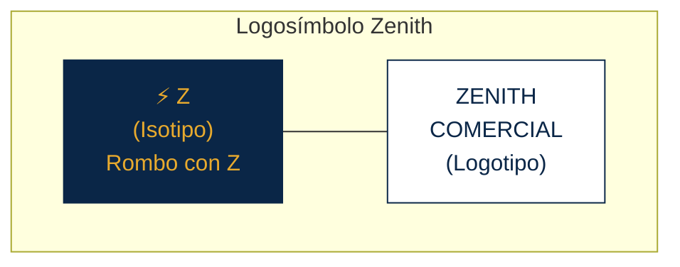
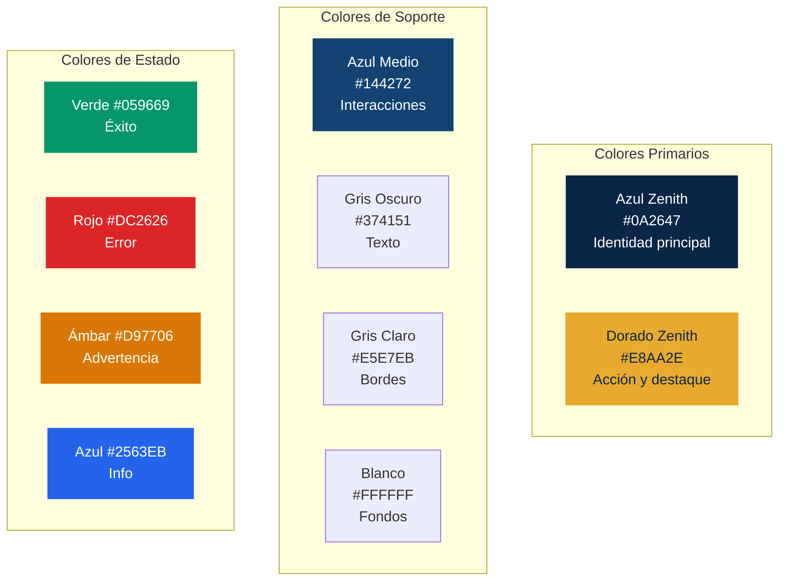
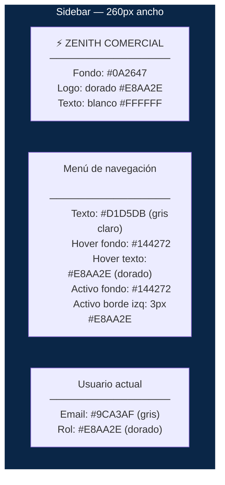
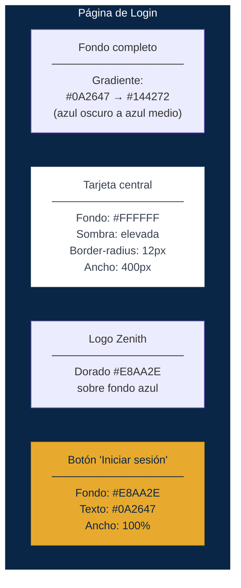

# Manual de Identidad Visual Corporativa

## ZENITH COMERCIAL S.A.S.

> **Versión:** 1.0
> **Fecha:** Abril 2026
> **Aprobado por:** Dirección General
> **Clasificación:** Documento interno — uso obligatorio en todas las piezas digitales e impresas

---

## Tabla de Contenidos

- [1. Presentación de la Empresa](#1-presentación-de-la-empresa)
- [2. Logosímbolo](#2-logosímbolo)
- [3. Paleta de Colores](#3-paleta-de-colores)
- [4. Tipografía](#4-tipografía)
- [5. Aplicación en el Sistema Web](#5-aplicación-en-el-sistema-web)
- [6. Iconografía](#6-iconografía)
- [7. Variables CSS](#7-variables-css)
- [8. Reglas de Uso](#8-reglas-de-uso)
- [9. Contacto](#9-contacto)

---

## 1. Presentación de la Empresa

### Nombre legal

**Zenith Comercial S.A.S.**

### Nombre comercial

**Zenith**

### Slogan

*"Tecnología al alcance de tu negocio"*

### Misión

Ser el aliado estratégico de empresas y emprendedores en la distribución de productos tecnológicos y electrónicos, ofreciendo precios competitivos, inventario confiable y un sistema de facturación ágil y transparente.

### Visión

Para 2030, ser la distribuidora de tecnología líder en la región andina, reconocida por la excelencia en su plataforma digital de comercio y gestión empresarial.

### Valores

| Valor | Significado |
|-------|------------|
| **Transparencia** | Todas las transacciones son rastreables y auditables |
| **Agilidad** | Procesos rápidos: cotizar, facturar y despachar en minutos |
| **Confianza** | Stock real, precios actualizados, facturas legales |
| **Innovación** | Plataforma digital propia para gestión de ventas |

### Sector

Distribución mayorista y minorista de productos de tecnología y electrónica:
- Computadores portátiles y de escritorio
- Monitores y periféricos
- Impresoras y suministros
- Tablets y accesorios
- Discos duros y almacenamiento

### Sedes

| Sede | Ciudad | Dirección |
|------|--------|-----------|
| Principal | Medellín | Calle 10 Sur #43A-100, Zona Industrial Guayabal |
| Sucursal Norte | Bogotá | Carrera 15 #77-05, Chapinero |
| Sucursal Sur | Cali | Avenida 6N #28-50, Barrio Granada |

---

## 2. Logosímbolo

### Concepto

El logosímbolo de Zenith combina la letra **Z** estilizada en forma de rayo (representando velocidad y tecnología) con el nombre completo de la empresa. El rayo forma una diagonal ascendente que simboliza **crecimiento y avance**.

### Logotipo completo

```
    ╱▔▔╲
   ╱ Z  ╲     ZENITH
  ╱______╲    COMERCIAL
```

**Composición:**



### Versiones

| Versión | Uso | Composición |
|---------|-----|-------------|
| **Horizontal** | Barra superior, documentos, facturas | Isotipo a la izquierda + logotipo a la derecha |
| **Vertical** | Favicon, redes sociales, espacios reducidos | Isotipo arriba + logotipo abajo |
| **Isotipo solo** | Favicon, app móvil, marca de agua | Solo el rombo con la Z |

### Sobre fondo claro

| Elemento | Color |
|----------|-------|
| Rombo (fondo del isotipo) | Azul oscuro `#0A2647` |
| Letra Z dentro del rombo | Dorado `#E8AA2E` |
| Texto "ZENITH" | Azul oscuro `#0A2647` |
| Texto "COMERCIAL" | Gris medio `#6B7280` |

### Sobre fondo oscuro

| Elemento | Color |
|----------|-------|
| Rombo (fondo del isotipo) | Dorado `#E8AA2E` |
| Letra Z dentro del rombo | Azul oscuro `#0A2647` |
| Texto "ZENITH" | Blanco `#FFFFFF` |
| Texto "COMERCIAL" | Gris claro `#D1D5DB` |

### Usos incorrectos

| Uso incorrecto | Por qué |
|----------------|---------|
| Cambiar los colores del isotipo | Los colores corporativos son inmutables |
| Rotar o inclinar el logosímbolo | Siempre debe estar horizontal o vertical |
| Agregar sombras, brillos o efectos 3D | El logo es plano (flat design) |
| Usar el logotipo sin el isotipo en piezas oficiales | Siempre deben ir juntos en documentos formales |
| Estirar o comprimir el logo | Mantener siempre las proporciones originales |
| Colocar el logo sobre fondos con patrones o fotografías sin filtro | Usar fondo sólido o agregar caja blanca/oscura detrás |

---

## 3. Paleta de Colores

### Colores principales

<table>
<tr>
<td style="background-color:#0A2647; width:120px; height:80px; border-radius:8px;"></td>
<td style="padding-left:16px;">
<strong>Azul Zenith (Primario)</strong><br>
HEX: <code>#0A2647</code><br>
RGB: <code>10, 38, 71</code><br>
CMYK: <code>86, 46, 0, 72</code><br>
<em>Uso: sidebar, encabezados, textos principales, fondo del login</em>
</td>
</tr>
</table>

<table>
<tr>
<td style="background-color:#E8AA2E; width:120px; height:80px; border-radius:8px;"></td>
<td style="padding-left:16px;">
<strong>Dorado Zenith (Secundario)</strong><br>
HEX: <code>#E8AA2E</code><br>
RGB: <code>232, 170, 46</code><br>
CMYK: <code>0, 27, 80, 9</code><br>
<em>Uso: botones primarios, links activos, iconos destacados, hover del menú</em>
</td>
</tr>
</table>

<table>
<tr>
<td style="background-color:#144272; width:120px; height:80px; border-radius:8px;"></td>
<td style="padding-left:16px;">
<strong>Azul Medio (Acento)</strong><br>
HEX: <code>#144272</code><br>
RGB: <code>20, 66, 114</code><br>
CMYK: <code>82, 42, 0, 55</code><br>
<em>Uso: hover de sidebar, encabezados de tabla, bordes activos de formulario</em>
</td>
</tr>
</table>

### Colores neutros

| Muestra | Nombre | HEX | Uso |
|---------|--------|-----|-----|
| <span style="display:inline-block;width:24px;height:24px;background:#FFFFFF;border:1px solid #ccc;border-radius:4px;vertical-align:middle;"></span> | Blanco | `#FFFFFF` | Fondo principal de contenido |
| <span style="display:inline-block;width:24px;height:24px;background:#F8F9FA;border:1px solid #ccc;border-radius:4px;vertical-align:middle;"></span> | Gris muy claro | `#F8F9FA` | Fondo de filas alternas en tablas |
| <span style="display:inline-block;width:24px;height:24px;background:#E5E7EB;border-radius:4px;vertical-align:middle;"></span> | Gris claro | `#E5E7EB` | Bordes de inputs, separadores |
| <span style="display:inline-block;width:24px;height:24px;background:#6B7280;border-radius:4px;vertical-align:middle;"></span> | Gris medio | `#6B7280` | Texto secundario, placeholders |
| <span style="display:inline-block;width:24px;height:24px;background:#374151;border-radius:4px;vertical-align:middle;"></span> | Gris oscuro | `#374151` | Texto principal del cuerpo |
| <span style="display:inline-block;width:24px;height:24px;background:#111827;border-radius:4px;vertical-align:middle;"></span> | Casi negro | `#111827` | Títulos principales |

### Colores de estado del sistema

| Muestra | Estado | HEX | Fondo HEX | Uso |
|---------|--------|-----|-----------|-----|
| <span style="display:inline-block;width:24px;height:24px;background:#059669;border-radius:4px;vertical-align:middle;"></span> | Éxito | `#059669` | `#ECFDF5` | Operación exitosa, factura creada, producto guardado |
| <span style="display:inline-block;width:24px;height:24px;background:#DC2626;border-radius:4px;vertical-align:middle;"></span> | Error | `#DC2626` | `#FEF2F2` | Error de validación, credenciales incorrectas, stock insuficiente |
| <span style="display:inline-block;width:24px;height:24px;background:#D97706;border-radius:4px;vertical-align:middle;"></span> | Advertencia | `#D97706` | `#FFFBEB` | Sesión por expirar, campos faltantes, factura anulada |
| <span style="display:inline-block;width:24px;height:24px;background:#2563EB;border-radius:4px;vertical-align:middle;"></span> | Información | `#2563EB` | `#EFF6FF` | Mensaje informativo, tips, notas del sistema |

### Diagrama de jerarquía de colores



---

## 4. Tipografía

### Fuente principal — Títulos

**Inter Bold / Semi-Bold**

| Propiedad | Valor |
|-----------|-------|
| Nombre | Inter |
| Pesos | Semi-Bold (600) para subtítulos, Bold (700) para títulos |
| Google Fonts | `https://fonts.googleapis.com/css2?family=Inter:wght@400;500;600;700&display=swap` |
| Fallback | `'Inter', 'Segoe UI', system-ui, -apple-system, sans-serif` |

### Fuente secundaria — Cuerpo de texto

**Inter Regular / Medium**

| Propiedad | Valor |
|-----------|-------|
| Nombre | Inter |
| Pesos | Regular (400) para texto, Medium (500) para énfasis |
| Motivo | Usar la misma familia para títulos y cuerpo mantiene la coherencia visual |

> **Por qué Inter:** Es una fuente diseñada específicamente para pantallas, con excelente legibilidad en tamaños pequeños. Es open source, gratuita y ampliamente soportada.

### Fuente monoespaciada — Datos y código

**JetBrains Mono**

| Propiedad | Valor |
|-----------|-------|
| Nombre | JetBrains Mono |
| Peso | Regular (400) |
| Google Fonts | `https://fonts.googleapis.com/css2?family=JetBrains+Mono:wght@400;500&display=swap` |
| Fallback | `'JetBrains Mono', 'Cascadia Code', 'Consolas', monospace` |
| Uso | Códigos de producto, números de factura, precios en tablas, campos de formulario numéricos |

### Jerarquía tipográfica

| Elemento | Fuente | Peso | Tamaño | Color | Uso |
|----------|--------|------|--------|-------|-----|
| **h1** | Inter | Bold (700) | 28px / 1.75rem | `#111827` | Título de página ("Gestión de Productos") |
| **h2** | Inter | Semi-Bold (600) | 22px / 1.375rem | `#111827` | Sección principal ("Listado") |
| **h3** | Inter | Semi-Bold (600) | 18px / 1.125rem | `#374151` | Subsección ("Formulario de creación") |
| **h4** | Inter | Medium (500) | 16px / 1rem | `#374151` | Encabezado menor |
| **Párrafo** | Inter | Regular (400) | 15px / 0.9375rem | `#374151` | Texto general del cuerpo |
| **Small** | Inter | Regular (400) | 13px / 0.8125rem | `#6B7280` | Texto secundario, ayudas, fechas |
| **Label** | Inter | Medium (500) | 14px / 0.875rem | `#374151` | Etiquetas de formulario |
| **Datos tabla** | JetBrains Mono | Regular (400) | 14px / 0.875rem | `#374151` | Códigos, precios, cantidades |
| **Número factura** | JetBrains Mono | Medium (500) | 16px / 1rem | `#0A2647` | "#F-000123" |

### Ejemplo de jerarquía

```
╔══════════════════════════════════════════════════╗
║  Gestión de Productos                    (h1)    ║
║                                                  ║
║  Listado de productos                    (h2)    ║
║                                                  ║
║  Se encontraron 8 productos en el       (párrafo)║
║  inventario actual.                              ║
║                                                  ║
║  ┌─────────┬──────────────────┬────────┐         ║
║  │ PR001   │ Laptop Lenovo    │$2.500k │  (mono) ║
║  │ PR002   │ Monitor Samsung  │  $800k │  (mono) ║
║  └─────────┴──────────────────┴────────┘         ║
║                                                  ║
║  Formulario de creación                  (h3)    ║
║                                                  ║
║  Nombre del producto               (label)       ║
║  ┌──────────────────────────────┐                ║
║  │ Escriba el nombre...        │  (placeholder)  ║
║  └──────────────────────────────┘                ║
║                                                  ║
║  Última actualización: 19/04/2026    (small)     ║
╚══════════════════════════════════════════════════╝
```

---

## 5. Aplicación en el Sistema Web

### Barra lateral (Sidebar)



| Elemento | Propiedad | Valor |
|----------|-----------|-------|
| Fondo sidebar | background-color | `#0A2647` |
| Ancho | width | `260px` |
| Logo (texto) | color | `#E8AA2E` |
| Item menú (normal) | color | `#D1D5DB` |
| Item menú (hover) | background-color | `#144272` |
| Item menú (hover) | color | `#E8AA2E` |
| Item menú (activo) | background-color | `#144272` |
| Item menú (activo) | border-left | `3px solid #E8AA2E` |
| Separador | border-color | `#1E3A5F` |

### Barra superior (Topbar)

| Elemento | Propiedad | Valor |
|----------|-----------|-------|
| Fondo | background-color | `#FFFFFF` |
| Borde inferior | border-bottom | `1px solid #E5E7EB` |
| Texto (título sección) | color | `#374151` |
| Nombre usuario | color | `#6B7280` |
| Botón "Cerrar sesión" | background | transparente |
| Botón "Cerrar sesión" | color | `#DC2626` |
| Botón "Cerrar sesión" | border | `1px solid #DC2626` |
| Botón "Cerrar sesión" (hover) | background | `#DC2626` |
| Botón "Cerrar sesión" (hover) | color | `#FFFFFF` |

### Botones

| Tipo | Fondo | Texto | Borde | Hover fondo | Uso |
|------|-------|-------|-------|-------------|-----|
| **Primario** | `#E8AA2E` | `#0A2647` | ninguno | `#D4991A` | Guardar, crear, confirmar |
| **Secundario** | transparente | `#0A2647` | `1px solid #0A2647` | `#0A2647` (texto blanco) | Cancelar, volver, editar |
| **Éxito** | `#059669` | `#FFFFFF` | ninguno | `#047857` | Aprobar, completar |
| **Peligro** | `#DC2626` | `#FFFFFF` | ninguno | `#B91C1C` | Eliminar, anular |
| **Outline peligro** | transparente | `#DC2626` | `1px solid #DC2626` | `#DC2626` (texto blanco) | Anular factura (acción reversible) |

```
┌─────────────┐  ┌─────────────┐  ┌─────────────┐  ┌─────────────┐
│   Guardar   │  │  Cancelar   │  │   Aprobar   │  │  Eliminar   │
│  (dorado)   │  │  (outline)  │  │   (verde)   │  │   (rojo)    │
└─────────────┘  └─────────────┘  └─────────────┘  └─────────────┘
   Primario        Secundario        Éxito           Peligro
```

### Tablas

| Elemento | Propiedad | Valor |
|----------|-----------|-------|
| Encabezado (thead) | background-color | `#0A2647` |
| Encabezado (thead) | color | `#FFFFFF` |
| Fila par | background-color | `#FFFFFF` |
| Fila impar | background-color | `#F8F9FA` |
| Fila hover | background-color | `#EFF6FF` |
| Borde | border-color | `#E5E7EB` |
| Texto datos | font-family | `'JetBrains Mono'` para códigos y números |
| Texto datos | color | `#374151` |
| Badge "activa" | background | `#ECFDF5`, color `#059669` |
| Badge "anulada" | background | `#FEF2F2`, color `#DC2626` |

### Formularios

| Elemento | Propiedad | Valor |
|----------|-----------|-------|
| Label | color | `#374151` |
| Label | font-weight | `500` (Medium) |
| Input (normal) | border | `1px solid #E5E7EB` |
| Input (normal) | border-radius | `6px` |
| Input (normal) | padding | `8px 12px` |
| Input (focus) | border-color | `#E8AA2E` |
| Input (focus) | box-shadow | `0 0 0 3px rgba(232, 170, 46, 0.15)` |
| Input (error) | border-color | `#DC2626` |
| Select (dropdown) | Mismos estilos que input |
| Placeholder | color | `#9CA3AF` |
| Texto de ayuda | color | `#6B7280`, tamaño `13px` |

### Alertas / Flash Messages

| Tipo | Fondo | Borde izquierdo | Texto | Icono |
|------|-------|-----------------|-------|-------|
| **Éxito** | `#ECFDF5` | `4px solid #059669` | `#065F46` | Checkmark |
| **Error** | `#FEF2F2` | `4px solid #DC2626` | `#991B1B` | X circle |
| **Advertencia** | `#FFFBEB` | `4px solid #D97706` | `#92400E` | Warning triangle |
| **Información** | `#EFF6FF` | `4px solid #2563EB` | `#1E40AF` | Info circle |

```
┌──────────────────────────────────────────────┐
│▌ ✓ Producto creado exitosamente.             │  Éxito (fondo verde claro)
└──────────────────────────────────────────────┘
┌──────────────────────────────────────────────┐
│▌ ✕ Error: credenciales incorrectas.          │  Error (fondo rojo claro)
└──────────────────────────────────────────────┘
┌──────────────────────────────────────────────┐
│▌ ⚠ La factura #3 ha sido anulada.            │  Advertencia (fondo ámbar claro)
└──────────────────────────────────────────────┘
┌──────────────────────────────────────────────┐
│▌ ℹ Debe cambiar su contraseña.               │  Info (fondo azul claro)
└──────────────────────────────────────────────┘
```

### Tarjetas (Cards)

| Propiedad | Valor |
|-----------|-------|
| background-color | `#FFFFFF` |
| border | `1px solid #E5E7EB` |
| border-radius | `8px` |
| box-shadow | `0 1px 3px rgba(0, 0, 0, 0.1)` |
| padding | `20px` |
| Título card | color `#111827`, font-weight `600` |

### Página de Login



---

## 6. Iconografía

### Librería de iconos

**Bootstrap Icons** (incluido con Bootstrap 5)

```html
<!-- Cargar via CDN -->
<link href="https://cdn.jsdelivr.net/npm/bootstrap-icons@1.11.3/font/bootstrap-icons.css" rel="stylesheet">
```

### Iconos del menú de navegación

| Módulo | Icono | Clase Bootstrap Icons |
|--------|-------|---------------------|
| Home / Dashboard | Casa | `bi bi-house-door` |
| Producto | Caja | `bi bi-box-seam` |
| Persona | Persona | `bi bi-person` |
| Empresa | Edificio | `bi bi-building` |
| Cliente | Personas | `bi bi-people` |
| Vendedor | Badge ID | `bi bi-person-badge` |
| Rol | Escudo | `bi bi-shield-lock` |
| Ruta | Señal | `bi bi-signpost-split` |
| Usuario | Persona engranaje | `bi bi-person-gear` |
| Factura | Recibo | `bi bi-receipt` |
| Permiso | Llave | `bi bi-key` |
| Cerrar sesión | Puerta salida | `bi bi-box-arrow-right` |

### Tamaños de iconos

| Contexto | Tamaño | Ejemplo |
|----------|--------|---------|
| Menú lateral | 18px | `<i class="bi bi-box-seam" style="font-size:18px;"></i>` |
| Botones | 16px | `<i class="bi bi-plus-lg"></i> Nuevo` |
| Encabezados | 22px | `<i class="bi bi-receipt"></i> Gestión de Facturas` |
| Alertas | 20px | `<i class="bi bi-check-circle"></i> Operación exitosa` |

### Color de iconos

| Contexto | Color |
|----------|-------|
| Menú (normal) | `#D1D5DB` (hereda del texto del menú) |
| Menú (hover/activo) | `#E8AA2E` (dorado) |
| Botones | Hereda del color del texto del botón |
| Alertas | Hereda del color del texto de la alerta |
| Acciones tabla (editar) | `#E8AA2E` |
| Acciones tabla (eliminar) | `#DC2626` |
| Acciones tabla (ver) | `#2563EB` |

---

## 7. Variables CSS

### Archivo `static/css/app.css`

Copiar estas variables al inicio del archivo CSS del proyecto. Todos los componentes deben usar variables, nunca colores directos.

```css
/* ================================================
   ZENITH COMERCIAL S.A.S.
   Variables de Identidad Visual
   Manual de Marca v1.0 — Abril 2026
   ================================================ */

:root {
    /* ── Colores principales ── */
    --color-primary:        #0A2647;   /* Azul Zenith */
    --color-secondary:      #E8AA2E;   /* Dorado Zenith */
    --color-accent:         #144272;   /* Azul Medio */

    /* ── Colores neutros ── */
    --color-white:          #FFFFFF;
    --color-bg:             #F8F9FA;   /* Fondo general */
    --color-border:         #E5E7EB;   /* Bordes */
    --color-text:           #374151;   /* Texto principal */
    --color-text-secondary: #6B7280;   /* Texto secundario */
    --color-text-heading:   #111827;   /* Títulos */
    --color-placeholder:    #9CA3AF;   /* Placeholders */

    /* ── Colores de estado ── */
    --color-success:        #059669;
    --color-success-bg:     #ECFDF5;
    --color-success-text:   #065F46;
    --color-danger:         #DC2626;
    --color-danger-bg:      #FEF2F2;
    --color-danger-text:    #991B1B;
    --color-warning:        #D97706;
    --color-warning-bg:     #FFFBEB;
    --color-warning-text:   #92400E;
    --color-info:           #2563EB;
    --color-info-bg:        #EFF6FF;
    --color-info-text:      #1E40AF;

    /* ── Tipografía ── */
    --font-heading:         'Inter', 'Segoe UI', system-ui, -apple-system, sans-serif;
    --font-body:            'Inter', 'Segoe UI', system-ui, -apple-system, sans-serif;
    --font-mono:            'JetBrains Mono', 'Cascadia Code', 'Consolas', monospace;

    /* ── Tamaños de fuente ── */
    --text-xs:    0.8125rem;   /* 13px — small, ayudas */
    --text-sm:    0.875rem;    /* 14px — labels, datos tabla */
    --text-base:  0.9375rem;   /* 15px — párrafo */
    --text-lg:    1.125rem;    /* 18px — h3 */
    --text-xl:    1.375rem;    /* 22px — h2 */
    --text-2xl:   1.75rem;     /* 28px — h1 */

    /* ── Bordes y radios ── */
    --radius-sm:   4px;
    --radius-md:   6px;
    --radius-lg:   8px;
    --radius-xl:   12px;

    /* ── Sombras ── */
    --shadow-sm:   0 1px 2px rgba(0, 0, 0, 0.05);
    --shadow-md:   0 1px 3px rgba(0, 0, 0, 0.1);
    --shadow-lg:   0 4px 6px rgba(0, 0, 0, 0.1);
    --shadow-xl:   0 10px 25px rgba(0, 0, 0, 0.15);

    /* ── Sidebar ── */
    --sidebar-width:        260px;
    --sidebar-bg:           var(--color-primary);
    --sidebar-text:         #D1D5DB;
    --sidebar-hover-bg:     var(--color-accent);
    --sidebar-hover-text:   var(--color-secondary);
    --sidebar-active-bg:    var(--color-accent);
    --sidebar-active-border: 3px solid var(--color-secondary);
    --sidebar-separator:    #1E3A5F;

    /* ── Tabla ── */
    --table-header-bg:      var(--color-primary);
    --table-header-text:    var(--color-white);
    --table-row-alt:        var(--color-bg);
    --table-row-hover:      var(--color-info-bg);
    --table-border:         var(--color-border);

    /* ── Botón primario ── */
    --btn-primary-bg:       var(--color-secondary);
    --btn-primary-text:     var(--color-primary);
    --btn-primary-hover:    #D4991A;

    /* ── Input focus ── */
    --input-focus-border:   var(--color-secondary);
    --input-focus-shadow:   0 0 0 3px rgba(232, 170, 46, 0.15);
}

/* ── Google Fonts ── */
@import url('https://fonts.googleapis.com/css2?family=Inter:wght@400;500;600;700&family=JetBrains+Mono:wght@400;500&display=swap');

/* ── Tipografía base ── */
body {
    font-family: var(--font-body);
    font-size: var(--text-base);
    color: var(--color-text);
}

h1, h2, h3, h4 {
    font-family: var(--font-heading);
    color: var(--color-text-heading);
}

h1 { font-size: var(--text-2xl); font-weight: 700; }
h2 { font-size: var(--text-xl);  font-weight: 600; }
h3 { font-size: var(--text-lg);  font-weight: 600; color: var(--color-text); }

code, .mono {
    font-family: var(--font-mono);
}
```

---

## 8. Reglas de Uso

### Espacios mínimos alrededor del logo

La distancia mínima entre el logosímbolo y cualquier otro elemento gráfico debe ser equivalente a la altura de la letra "Z" del isotipo.

```
        ┌───┐
        │ Z │ ← altura = X
        └───┘
    
    ←X→ ┌───────────────────┐ ←X→
        │                   │
    ←X→ │  ⚡ Z  ZENITH     │ ←X→
        │     COMERCIAL     │
    ←X→ │                   │ ←X→
        └───────────────────┘
```

### Tamaño mínimo del logo

| Versión | Impresión | Pantalla |
|---------|-----------|---------|
| Horizontal | 3.5 cm de ancho | 100px de ancho |
| Vertical | 2.0 cm de ancho | 56px de ancho |
| Isotipo solo | 1.0 cm | 28px |

### Combinaciones de color prohibidas

| Combinación | Por qué no |
|-------------|-----------|
| Dorado sobre blanco | Contraste insuficiente — el dorado se pierde |
| Azul oscuro sobre negro | Contraste insuficiente — no se distinguen |
| Texto gris claro sobre fondo blanco | Problemas de accesibilidad (WCAG AA) |
| Colores de estado como fondo de secciones completas | Los colores de estado son solo para alertas puntuales |

### Lo que NUNCA se debe hacer

| Prohibición | Motivo |
|------------|--------|
| Usar otros tonos de azul o dorado "parecidos" | Los códigos HEX son exactos. `#0A2647` no es `#0B2748` |
| Usar fuentes diferentes a Inter y JetBrains Mono | La coherencia tipográfica es parte de la identidad |
| Poner el logo sobre fotografías sin caja de fondo | El logo debe ser siempre legible |
| Usar gradientes en botones o elementos interactivos | El diseño es flat (plano). Sin degradados, sombras internas ni efectos 3D |
| Usar más de 2 colores de estado en la misma vista | Sobrecarga visual. Si hay muchas alertas, agruparlas |

---

## 9. Contacto

### Datos de la empresa

| Campo | Valor |
|-------|-------|
| **Razón social** | Zenith Comercial S.A.S. |
| **NIT** | 901.456.789-2 |
| **Dirección principal** | Calle 10 Sur #43A-100, Medellín, Colombia |
| **PBX** | (604) 312-4567 |
| **Línea nacional** | 01 8000 934 648 |
| **Web** | www.zenithcomercial.com |
| **Email general** | info@zenithcomercial.com |
| **Email soporte** | soporte@zenithcomercial.com |

### Redes sociales

| Red | Usuario |
|-----|---------|
| Instagram | @zenithcomercial |
| LinkedIn | Zenith Comercial S.A.S. |
| Facebook | /zenithcomercial |

---

> **Este manual es de cumplimiento obligatorio.** Toda pieza digital o impresa de Zenith Comercial debe seguir los lineamientos aquí establecidos. Cualquier excepción debe ser aprobada por la Dirección General.
>
> **Documento controlado** — Versión 1.0 — Abril 2026
